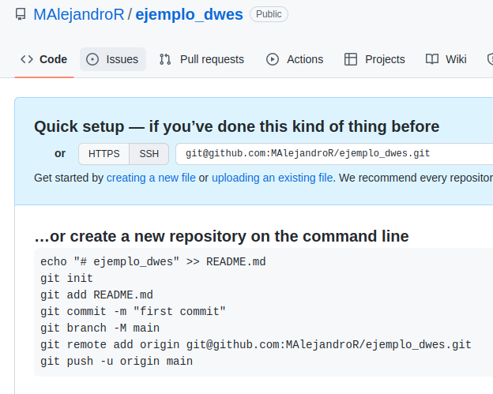
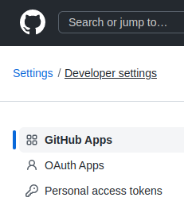

{}
:white_check_mark:
**Objetivo**:
* Crear un repositorio en github
* Crear un proyecto en local, crear un repositorio local y enlazarlo con el repositorio de github
* Realizar cambios en local, subirlo a github, clonar proyectos y actulizarlos

**Páginas referenciadas o de consulta**
* https://https://www.atlassian.com/es/git
{}


## Crear un usuario en git
Para ello accedemos a la página oficial de git https://github.com y buscamos la opción **Sig up**


Una vez presionado el botón, aportamos los datos que nos solicita y nos registramos

## Crear un nuevo repositorio

Entrando con nuestro usuario y password, ya podemos crear un nuevo repositorio (la idea es  crear un directorio que llamo de una forma para guardar un determinado proyecto en la nube).

Buscamos la opción de nuebo repositorio y lo presionamos


Entonces nos mostrará un menú para insertar un nuevo repositorio


Insertamos un nombre y presionamos al final de la página el botón *****Create Repository*****


Una vez creado vemos una serie de instrucciones que debemos de escribir en nuestro proyecto local, creando un repositorio en local y  ligarlo a este repositorio


## Crear un proyecto en local y crear un repositorio
Ahora vamos a local y ejecutamos las instrucciones que nos ha indicado el servidor de github para crear el repositorio en local y vincularlo al repositorio en github
Previamente a configurar el proyecto, y solo la primera vez, ya que se hará de forma **global**, vamos a configurar nuestros datos de git en local con los siguientes comandos
```bash
git config --global user.name NombreUsuarioGit
git config --global user.mail emailUsuarioGiyt

```

Una vez configurado el sitio, suponemos que tenemos un proyecto en local bajo un directorio donde nos ubicaremos
Ahí escribimos:
1. **Para crear el directorio en local**
```bash
git init
```
>>Este comando crearé un directorio en local llamado .github que inicializará el repositorio en local
2. **Agregar ficheros al repositorio**
```bash
git add *
```
> Este comando agregará todos los ficheros del directorio al repositorio en local

> Se excluirán aquellos ficheros que estén especificados en un fichero especial llamado .gitignore (el punto es porque es un fichero oculto)
3. **Establecer un comentario de checkpoint**
```bash
git commit -m "Primera actualización del proyecto" 
```
> Creamos un mensaje que se asociará al commit actual cuando subamos los ficheros al proyecto

4. **Establecemos la rama principal de trabajo**
```bash
git branch -m main
```
> En este caso establecemos la rama de trabajo **main**. Un proyecto puede tener varias ramas, las cuales llevan una vida independiente en el desarrollo del proyecto hasta que se unan o establezca un  **merge** al proyecto principal
5. **Ligamos el proyecto local al remoto**
```bash
git remote add origin main   https://github/Usuario/Proyecto.git *
```
> Ligamos el proyecto que tenemos en local al repositorio de github, unido, en este caso, a la rama main. En local la rama se llama **origin**.
6. **Submimos el proyecto de local a remoto**
```bash
git push origin main *
```
> Este comando sube todos los ficheros preparados (que se han unido con el comando **add**), asignándoles el mensaje asociado al comando **commit** al repositorio en remoto de github

## Realizar cambios en local y subirlos a git
Ahora trabajaremos con normalidad en nuestro proyecto y cuando consideremos (un buen criterio es que hayamos realizado una parte funcional, no se trata de subir el proyecto cada 5 minutos)
Cuando lo queremos subir repetimos estos tres pasos
```shell
git add *
git commit -m "con esta parte funcionando ..."
git push origin main
```
## Clonar el proyecto en local
Ahora si vamos a otro ordenador y queremos trabajar con nuestro proyecto, lo tenemos que descargar o clonar. 

Para ello necesitamos la referencia del proyecto que podemos obtener accediendo a nuestro repositorio, y en el botón code, ver la referencia


```shell
git clone https://github.com/Usuario/proyecto.git
```
Ahora trabajamos en el proyecto y lo vamos modificando haciendo los push que correspondan

## Actualizar el proyecto engi github
En este caso, si volvemos a otro equipo donde tenemos el proyecto, el cual lo hemos modificado en un equipo diferente, lo tendremos que actualizar del servidor, antes de seguir trabajando. Esto lo hacemos con el comando pull
```shell
git pull
```
Y continuamos trabajando

## Credenciales para trabajar con git
Siempre que queramos interactuar con el proyecto, nos va a pedir que nos identifiquemos.
Pero git, ya no permite identificarse con el password, si no que hay que crearse un token, e identificarse con ese token.
Para crear un token accedemos a la opción Settings del menú de nuestro usuario


Entonces en la parte izquierda, vamos a la opción *****Developer setting*****


Al presionar sale un menú y volvemos a seleccionar la opción *****Personal access token*****



Ahí podemos generar un nuevo token, asignar su caducidad y debemos asigar los ***scope*** o permisos que indican qué se puede hacer con ese token. Debemos dar permisos para acceder al repositorio
En esta acción, sí que exige que nos identifiquemos con nuestra password


### Tocken
### Clave pública y privada


Crear 