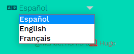

{}
* Ver cómo establecer diferentes lenguajes en nuestro proyecto
* https://gohugo.io/content-management/multilingual/
* https://learn.netlify.app/en/cont/i18n/
## Para este cometido

    1.- Vamos a actualizar el trabajo realizado para los diferentes idiomas 
    2.- Vamos a usar la plantilla relearn, y veremos también cómo actualizar la primera pantalla
    3.- Para la traducción usaremos translate de google
    4.- Si quieres puedes crear un proyecto de 0 para centrarte en este aspecto de un proyecto
{}

**Como crear un proyecto en hugo y establecer la plantilla relearn**
```bash
     hugo new site idiomas
     cd idiomas
     git init
     git submodule add https://github.com/matcornic/hugo-theme-learn.git themes/learn
```



# Multilenguaje
Hugo permite establecer el multilenguaje
 para adaptar las páginas en el lenguaje deseado

> Para ello, lo primero modificamos el fichero de configuración  estableciendo los idiomas
    >> Vamos a establecer 3 idiomas : inglés, francés, y español
```toml


[Languages]
    [Languages.es]
        title = "Ejemplo para el uso de idiomas"
        weight = 1
        languageName = "Español"
    [Languages.en]
        title = "Example use language"
        weight = 2
        languageName = "English"
   [Languages.fr]
        title = "Exemple d'utilisation des langues"
        weight = 3
        languageName = "Français"
```
Vemos como las variables usadas son claras en su función. weight, como ya sabemos establece el orden en el que aparecerán en el menú
{}
 **Listado de idiomas configurado**
 ***

{}


En este caso vamos a establecer diferentes directorios para establecer la ubicación de los ficheros. Deberá de aparecer un menú para ver las diferentes opciones del menú.

Ahora podremos establecer un idioma por defecto también con variables en el fichero **config.toml**
```toml
defaultContentLanguage = 'es'
```


### Cambiando la página por defecto

Esto es algó concreto de esta plantilla


Lo primero que observamos es que si cambiamos de idioma el contenido no cambia, por lo que tenemos que establecer el contenido de la página en los idiomas que queramos establecer

En el caso de **relearn** la página que nos muestra, si no hay contenido en la carpeta content, es el contenido del fichero **index.html** Si entramos en él, y así vemos cómo utilizar la estructura de control en una plantilla, vemos claramente dónde se ubica la traducción, ya que por defecto, esta plantilla está preparada para inglés y francés. Añadamos el español.
Para ello observa y utiliza la estructura de controlc   if  - else if - end
  
{}
 Recuerda realizar las modificaciones copiando los ficheros en la carpeta layout
 ```html
 {{if eq .Site.Language.Lang "fr"}}
		<h1>Personaliser la page d'accueil</h1>
        <!--Usa el traductor para completar esta parte-->
	
	{{else if eq .Site.Language.Lang "es" }}
		<h1>Personaliza tu página principal</h1>
	
	{{else if eq .Site.Language.Lang "en"}}
			<h1>Customize your own home page</h1>
            <!--Usa el traductor para completar esta parte-->
	{{end}}
 ```
{}


### Cambiando valores a través de variables

Ahora observamos que aunque cambie el contenido, hay palabras con que no se adaptan al idioma esablecido

Vamos a hacer que estas palabras, también sean traducidas. Lógicamente no vamos a cambiar toda la página para una palabra, sino, lo que haremos es usar un fichero para traducirlas y que el sistema obtenga el valor del fichero que corresponda al idioma establecido según una etiqueta

Con uso podemos usar la librería **[i18n](https://developer.mozilla.org/es/docs/Mozilla/Add-ons/WebExtensions/API/i18n)** para traducciones (internacionalización)

En la estructura de carpetas, dentro de **themes**, hay ficheros para traducir o establecer identificadores que se pueden adaptar a diferentes idiomas.
Vemos cómo estos ficheros empiezan con dos letras que identifican el idioma
[Lista de ficheros de traducciones](/static/lista_i18n_traducciones.png)

Vamos a establecer nuevos valores para cambiar las siguientes palabras. Vemos que la palabra de buscador ya sí que se adapta

* Home
* Build witdh ... from ... and

Para ello vamos a usar la función de traducción de hugo 
```hugo
{{ T "identificador_valor" }}
```
Con esto lo que hacemos es buscar el identificador **identificador_valor** en el fichero del idioma establecido y colocar su valor

En este fichero podemos tener valores para singular y plural. **others** sería el identificador general (normalmente el que querremos utilizar), ver más sobre esto en la documentación oficial
{}

Cambia las palabras que hemos indicado
Mira el fichero **menu-footer.html** y **menu.html** para localizar los items
No olvides modificar los ficheros copiándolos previamente a tu carpeta **layout**
{}


### Añadiendo menús en la página principal

Si queremos establecer menú en la página principal y que esté en diferentes idiomas

```toml

 [[languages.es.menu.main]]
    name = "Otros"
    weight = 50
    url = "https://github.com/google/docsy/"
 [[languages.en.menu.main]]
    name = "Other"
    weight = 50
    url = "https://github.com/google/docsy/"

  [[menu.main]]
     name = "GitHub"
    weight = 50
    url = "https://github.com/google/docsy/"
    pre = "<i class='fab fa-github'></i>"
    post = "<span class='alert'>New!</span>" 
```

### Añadiendo páginas traducidas a nuestro sitio

A la hora de especificar las traducciones. Es sistema va a esperar tener un fichero para cada uno de los idiomas establecidos. Es decir, si tenemos una página llamada **tema1.md** y tenemos 3 idiomas, como es el caso que hemos planteado, deberemos de alguna manera especificar un fichero *tema1.md* para cada uno de los idiomas.

Para hacer esto tenemos dos opciones. Vamos a ver aquí una de ellas, y la otra la podéis consultar en la página de referencia
> https://gohugo.io/content-management/multilingual/#translate-your-content

La solución que aplicamos es tener un directorio para cada uno de los idiomas. 


Una vez que lo hemos establecido, debemos indicar en el fichero de configuración con la variable **contentDir**, el directorio dónde se ubicarán los ficheros traducidos a ese idioma, de forma que en el caso que estamos añadiendo esta variable, nos debería quedar

```toml
[Languages]
    [Languages.en]
        title = "Example use language"
        weight = 2
        languageName = "English"
        ContentDir="/content/fr"

    [Languages.es]
        title = "Ejemplo para el uso de idiomas"
        weight = 1
        languageName = "Español"
        ContentDir="/content/es"
   [Languages.fr]
        title = "Exemple d'utilisation des langues"
        weight = 1
        languageName = "Français"
        ContentDir="/content/fr"
```

Una vez hecho esto, hemos de crear cada uno de los ficheros en cada directorio, no los replica hugo
{}
 **Crear ficheros md**
 ***
 
{}
 
 

Una vez creada ya lo único que queda es poner contenido. Para el ejercicio utiliza *translate* para  realizar la traducción en los dos idiomas


### Añadiendo menús

Estas acciones hay que añadirlas en el fichero de configuración
En el caso de learn se añade usando la siguiente sintaxis
```toml
[[Languages.en.menu.shortcuts]]
            name = "Public Center  Enlaces"
            url = "http://cpilosenlaces.com"
            identifier = "cp"
            weight= 10
[[Languages.en.menu.shortcuts]]
            name = "Language PHP"
            url = "http://php.net"
            identifier = "php"
            weight= 11
[[Languages.en.menu.shortcuts]]
            name = "Wiki Documentation"
            identifier = "wiki"
            url = "http://es.wikieducator.org/Usuario:ManuelRomero"
            weight= 12            
```

### Práctica

:smiley:
**Añade 3 lenguajes a la página**

1. Establece tres idiomas para la página (es, en, fr)

2. Utiliza translate para realizar la traducción de los ficheros **md** (markdonw)
